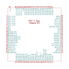

# Milk-V Duo KiCad Footprints

KiCad symbol/footprint library for the Milk-V Duo series of SBC's.
The Duo is a line of small form factor RISC-V and ARM SBC's that are
are capable of running Linux.

This library provides symbol and SMD footprints for the Duo family 
in your hardware designs.

## Provided Components

### Duo (CV1800B)

| Symbol | Footprint | 3D Model |
|--------------|-----------------|----------------|
| Not Available | Not Available | Not Available |

### Duo 256M (SG2002)

| Symbol | Footprint | 3D Model |
|--------------|-----------------|----------------|
| Not Available | Not Available | Not Available |

### Duo S (SG2000)

| Symbol | Footprint | 3D Model |
|--------------|-----------------|----------------|
| Not Available | Not Available | Not Available |

### Duo Module 01 (SG2000)

| Symbol | Footprint | 3D Model |
|--------------|-----------------|----------------|
|  |  | Not Available |
